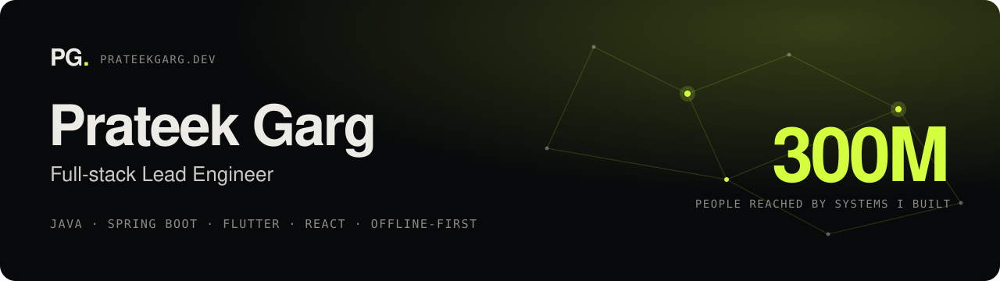

### My software runs where the network doesn't.

For nine years I've built health platforms that work offline on low-end phones and meet government deadlines. They run on Java backends, Flutter apps and React/Angular web apps, all end to end. Today those systems reach **300 million people**, and **250,000+ health workers** use them every day.

I'm a Group Lead at [Argusoft](https://www.argusoft.com), leading a team of 10+ engineers in a 40-engineer group, and I still write code every day. **I'm open to lead engineering roles in the UK.**

  
  
  

### Selected work

| Result | What I did |
|---|---|
| **Sync time from 5 min to ~10 s** | Redesigned offline sync and tuned the heaviest queries for Uttar Pradesh's eKavach, which serves 220M citizens. |
| **A new form in a day** | Built a configuration-driven platform where forms, rules and workflows are data, not code. A new state goes live in a week. |
| **1 codebase, 12 deployments** | Led the migration from native Android to Flutter, with a shared design system, multi-flavor builds and Jenkins CI/CD. |
| **Data entry from 3–4 min to ~20 s** | Built voice-first forms using Whisper, an on-device Qwen model offline and Gemini online. |

### Proof

- **[MEDplat](https://www.medplat.org)**: the open-source platform I've helped build since 2017. It's a registered Digital Public Good, deployed in India, Cambodia, Zambia, Jamaica and Nigeria.
- **[Shelfmark](https://github.com/prtkgrg/shelfmark)**: my side project, a Flutter app for tracking reading progress through PDF collections.

### Stack

I also work with microservices, HL7 FHIR, offline-first sync and conflict resolution, and on-device AI.
